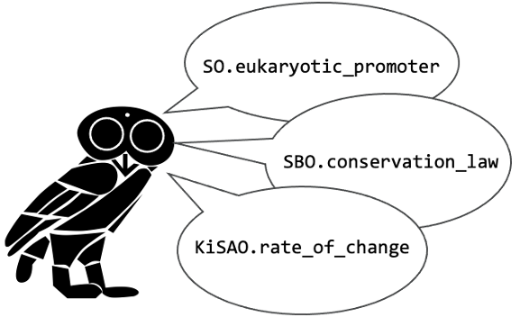

# TYTO
**Take Your Terms from Ontologies (TYTO)** is a lightweight Python tool that makes the semantic web more user-friendly and accessible.

TYTO provides a handy interface for ontologies for use in your Python application. It automatically generates symbols for URIs based on the ontology terms themselves. Currently the following ontologies are supported:

- Sequence Ontology (SO)
- Systems Biology Ontology (SBO)
- National Cancer Institute Thesaurus (NCIT)
- Ontology of Units and Measures (OM)

For example:
```
>>> from tyto import SO, SBO
RDFLib Version: 5.0.0
>>> print(SO.promoter)
http://purl.obolibrary.org/obo/SO_0000167
>>> print(SBO.systems_biology_representation)
http://biomodels.net/SBO/SBO_0000000
```
These symbols are not hard-coded, rather they are dynamically generated by querying the appropriate ontology endpoints. Alternatively an ontology can be imported from a local OWL file.

Additionally ontologies have methods that allow for other types of inference.
```
>>> SO.get_term_by_uri('http://purl.obolibrary.org/obo/SO_0000167')
'promoter'
```

An interface for a new ontology can be configured as follows, thus allowing for dynamic lookup of terms and URIs. 
```
my_ontology = Ontology(endpoint='http://myendpoint.org/sparql#', path='./ontologies/my_ontology.owl')
```

## About our mascot

_Tyto deroepstorffi_, otherwise known as the Andaman masked owl, is the mascot for this repo. An owl was considered an appropriate choice because TYTO leverages the Web Ontology Language (OWL).



## Acknowledgments

Development of this library has been supported by the [DARPA Synergistic Discovery and Design (SD2)](https://www.darpa.mil/program/synergistic-discovery-and-design) program and [Raytheon BBN Technologies](http://bbn.com/).
